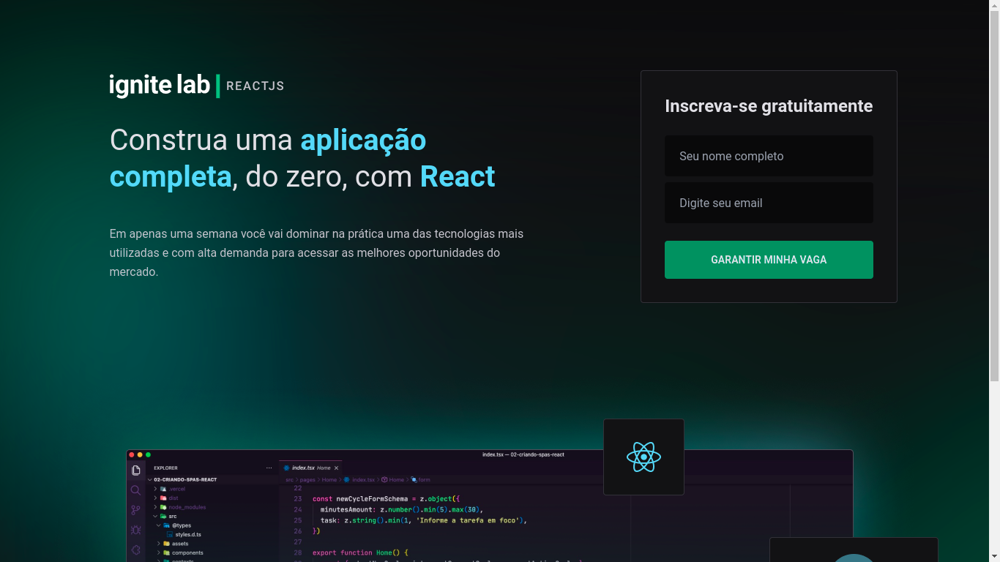
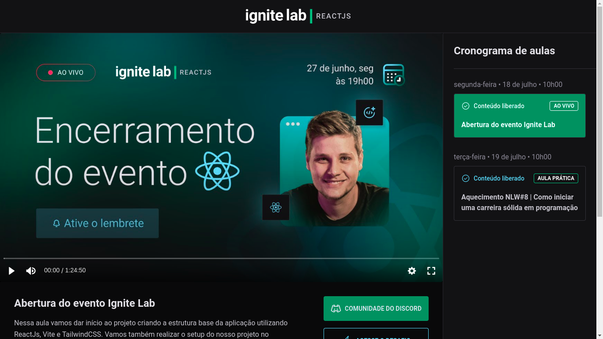

<div align="center">
    
</div>

<h1 align="center">Event Platform</h1>

<p align="center">
  
  
  
  
  
  
  
</p>

<p align="center">
    
    
</p>

## How to use

To clone and run this project, you'll need **[Git](https://git-scm.com)**, **[node v14.20](https://nodejs.org/en/)** or higher + **[yarn v1.22.15](https://yarnpkg.com)** or higher installed on your computer. From your command line:

```bash
#Clone this repository
$ git clone https://github.com/RenanTRS/event-platform.git

#Go into the repository
$ cd event-platform

#Install dependencies
$ yarn
#or
$ npm i

#Run
$ yarn dev
#or
$ npm run dev
```

## Built with

- [](https://vitejs.dev/guide/#scaffolding-your-first-vite-project)
- [](https://reactjs.org/)
- [](https://www.typescriptlang.org/)
- [](https://tailwindcss.com/)
- [](https://graphql.org/)
- [](https://www.apollographql.com/)
- [](https://eslint.org/)
- [](https://prettier.io/)
- [](https://vimejs.com/)
- [](https://date-fns.org/)
- [](https://phosphoricons.com/)

## Contact

- Email me - renantrsouza@gmail.com
- Connect with me on [LinkedIn](https://www.linkedin.com/in/renantrsouza/)

## License

This project is licensed under the MIT License - see the [LICENSE](https://github.com/renantrs/event-platform/blob/main/LICENSE) file for details.
